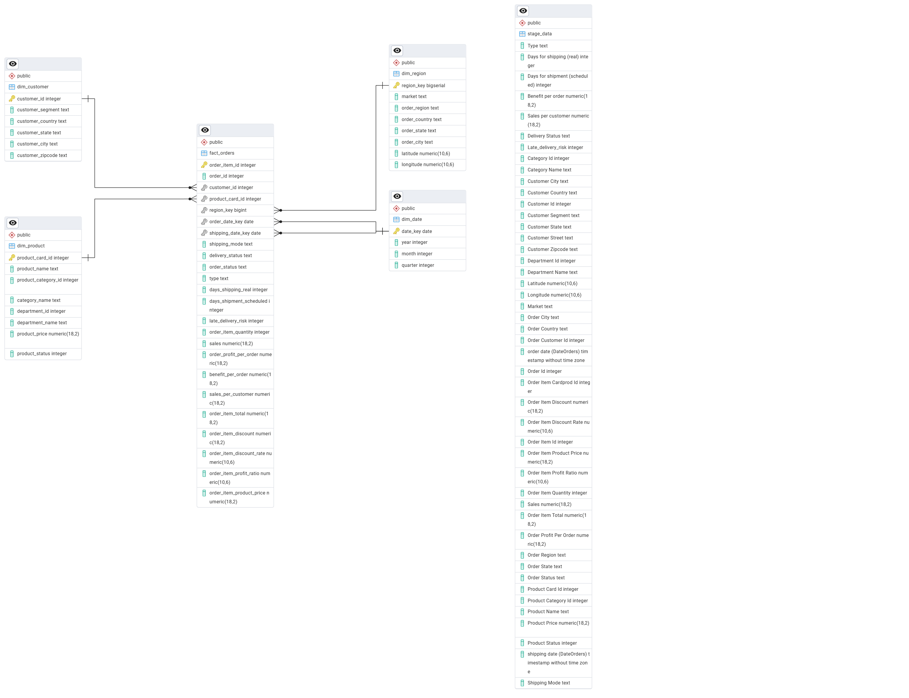
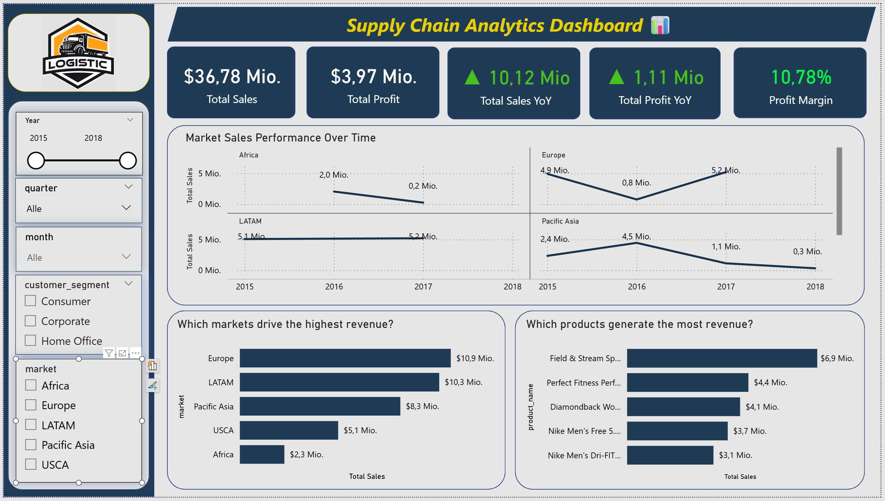
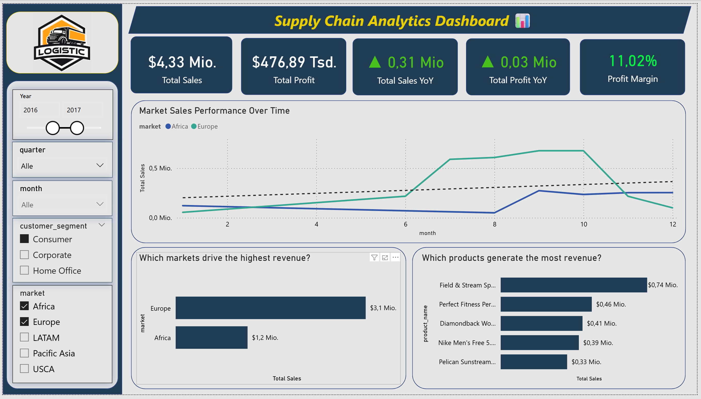
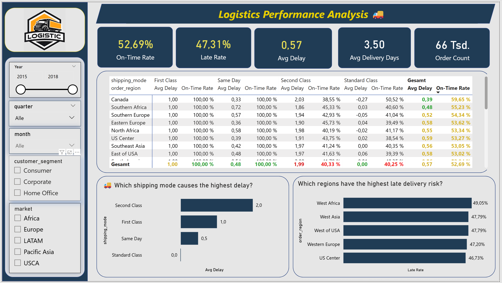
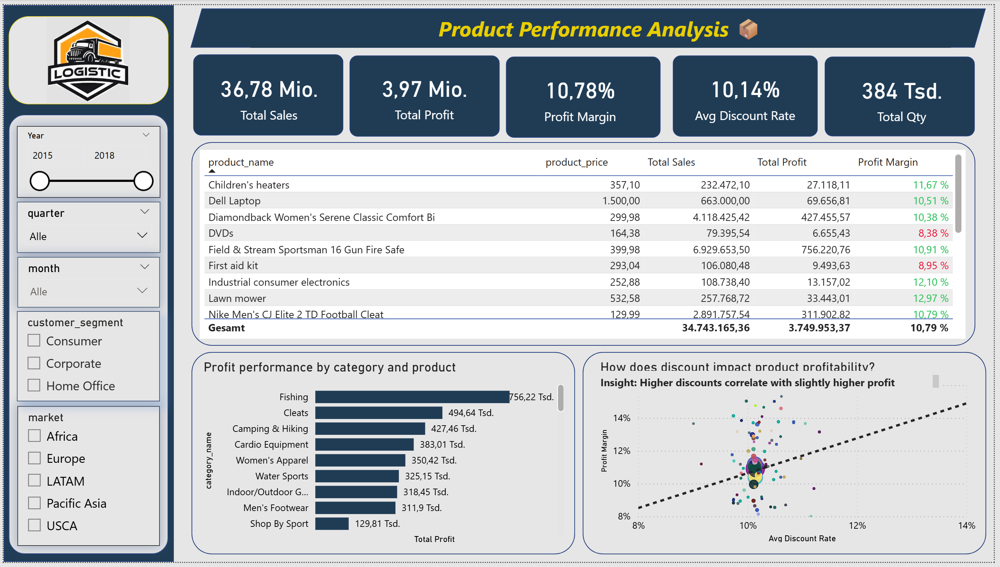

# End-to-End Supply Chain Analytics Platform


## Project Overview

This project demonstrates an end-to-end data analytics workflow for analyzing supply chain performance.

The goal of this project is to transform raw operational data into actionable business insights using Python, SQL, and Power BI.

The project includes data cleaning, exploratory data analysis, data warehouse modeling, and KPI reporting through an interactive dashboard.

---

## Business Problem

Supply chain operations generate large volumes of transactional data, but organizations often struggle to transform this raw data into actionable insights.

This project focuses on analyzing supply chain performance to answer key business questions related to revenue generation, shipping efficiency, product profitability, and market performance.

---

## Dataset

The dataset used in this project is the **DataCo SMART SUPPLY CHAIN FOR BIG DATA ANALYSIS** dataset available on Kaggle.

The data is stored in **CSV format** and contains more than **180,000 rows** of supply chain and sales records.

Dataset characteristics:

- Source: Kaggle
- Dataset Name: DataCo SMART SUPPLY CHAIN FOR BIG DATA ANALYSIS
- Format: CSV
- Size: ~180k records
- Domain: Supply Chain & Sales Analytics

The dataset includes information about:

- Orders  
- Customers  
- Products  
- Shipping performance  
- Markets and regions  
- Sales and profit metrics  

This dataset enables analysis of operational performance, logistics efficiency, and product profitability across different markets.

---

## Exploratory Data Analysis (EDA)

Exploratory Data Analysis was performed using **Python (Pandas, NumPy)** to understand the structure and quality of the dataset.

Key EDA tasks included:

- Data cleaning and handling missing values  
- Identifying outliers  
- Sales and profit distribution analysis  
- Shipping delay investigation  
- Product and market performance exploration  

---

## Data Architecture

The analytics workflow follows a structured end-to-end data pipeline:

1. **Raw Dataset (CSV Files – Kaggle)**  
   Supply chain dataset containing more than **180,000 rows** stored as CSV files.

2. **Data Cleaning & EDA – Python (Pandas, NumPy)**  
   Data preprocessing, handling missing values, and exploratory analysis using Python.

3. **Data Warehouse Modeling – PostgreSQL**  
   Implementation of a **Star Schema data warehouse** including fact and dimension tables.

4. **SQL Analytics**  
   Advanced SQL queries including **aggregations and window functions** for analytical reporting.

5. **KPI Calculation – DAX (Power BI)**  
   Business metrics and management KPIs calculated using DAX.

6. **Interactive Dashboard – Power BI**  
   Visualization of supply chain insights across management, logistics, and product performance dashboards.

---

## Data Warehouse Design

A **PostgreSQL data warehouse** was implemented using a **Star Schema architecture** to support efficient analytical queries and business intelligence reporting.

The architecture consists of two main layers:

### 1. Staging Layer
The staging layer stores the raw data imported from the cleaned CSV dataset before transformation.

### 2. Data Warehouse Layer
The analytical data warehouse is structured using a **Star Schema**, consisting of:

- **Fact Table**
  - `fact_orders`

- **Dimension Tables**
  - `dim_product`
  - `dim_customer`
  - `dim_date`
  - `dim_region`

This structure improves query performance and supports KPI calculations for supply chain analytics.



---

## SQL Analysis

Advanced SQL queries were developed for analytical reporting, including:

- Aggregations  
- Window Functions  
- Profit and revenue calculations  
- Market and product performance analysis  

---
### Example SQL Query

The following example calculates total revenue and profit by market:
```sql
SELECT 
    market,
    SUM(sales) AS total_revenue,
    SUM(profit) AS total_profit
FROM fact_orders
GROUP BY market
ORDER BY total_revenue DESC;
```
---
### Key Business KPIs

The following management KPIs were implemented:

- Total Revenue
- Total Profit
- Profit Margin
- Average Shipping Delay
- Late Delivery Rate
- Top Performing Products
- Market Revenue Distribution

---

## Power BI Dashboard

An interactive **Power BI dashboard** was developed to monitor key supply chain KPIs and support data-driven decision-making across management, logistics, and product performance.

The dashboard is organized into three analytical pages:

### 1. Management Overview
Provides an executive summary of overall business performance, including:
- Total Sales
- Total Profit
- Year-over-Year Growth
- Profit Margin
- Revenue by Market
- Top Products by Sales

**Dashboard Overview**


**Filtered Example**
The filtered example highlights how users can interactively explore performance by specific markets, customer segments, and selected time periods.



### 2. Logistics Performance
Focuses on operational efficiency and delivery service levels, including:
- On-Time Rate
- Late Rate
- Average Delay
- Average Delivery Days
- Shipping Mode Comparison
- Regional Late Delivery Risk



### 3. Product Performance
Provides insights into product-level sales and profitability, including:
- Total Sales and Profit
- Profit Margin
- Discount Rate
- Quantity Sold
- Profit by Category
- Discount vs. Profitability Analysis



---

## Key Insights

Based on the analysis of the supply chain dataset, several important insights were identified:

### Logistics Insights
- **Second Class shipping** shows the highest average delivery delay (~2 days), indicating potential inefficiencies in this shipping method.
- The overall **On-Time Delivery Rate is about 52.7%**, while **Late Deliveries reach 47.3%**, suggesting significant room for logistics optimization.
- Regions such as **West Africa, West Asia, and Western Europe** show the highest late delivery risk.

### Market Performance Insights
- **Europe and LATAM** generate the highest total revenue among all markets.
- **Africa** shows the lowest total sales, indicating potential market growth opportunities.
- Sales trends show seasonal fluctuations across markets, with some regions experiencing strong growth during specific periods.

### Product Performance Insights
- Products like **Field & Stream Sportsman** and **Perfect Fitness Performance products** generate the highest revenue.
- **Fishing and Cleats categories** contribute the highest total profit.
- A slight positive correlation between **discount rate and profit margin** was observed, indicating that moderate discounts may increase sales volume without significantly harming profitability.

### Business Implications
- Optimizing **Second Class shipping operations** could significantly improve delivery performance.
- Expanding marketing and distribution in **high-growth markets** may increase total revenue.
- Strategic discounting can be used to increase sales while maintaining profitability.

---

## Tech Stack

- Python (Pandas, NumPy)
- SQL
- PostgreSQL
- Power BI
- DAX
- Data Warehousing
- ETL

---

## Project Structure

```text
supply-chain-analytics-platform
│
├── data
│   └── dataset-description.md
│
├── images
│   ├── README.md
│   ├── dashboard-management.png
|   ├── filtered_dashboard-management.png
│   ├── dashboard-logistics.png
│   └── dashboard-product.png
│
├── notebooks
│   ├── data-cleaning_pipeline.ipynb
│   └── exploratory-data-analysis.ipynb
│
├── sql
│   ├── create-tables.sql
│   ├── insert-data.sql
│   └── analytical-queries.sql
│
└── README.md
```

Each folder represents a stage of the end-to-end data analytics workflow:

- **data** → dataset description and source information  
- **notebooks** → Python notebooks for data cleaning and exploratory data analysis (EDA)  
- **sql** → PostgreSQL scripts for building the data warehouse (star schema) and analytical queries  
- **images** → screenshots of the Power BI dashboards and the ERD (Entity Relationship Diagram) used for project documentation


---

## Author

**Abdelrahman Eissa**

Data Analyst | Supply Chain Analytics | Business Intelligence

- Python (Pandas, NumPy)
- SQL & PostgreSQL
- Power BI
- Data Warehousing

GitHub: https://github.com/abdelrahman-eissa-data
